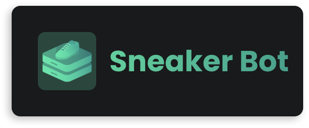

<a href="https://mblais-portfolio.netlify.app/">

  

</a>

  
  
  
  
  
  
  <!--
  -->
  

  
  
  <!----!>

##

<h1>
Sneaker Bot
</h1>

Sneaker Bot is a stock bot made for the Nike website. Currently this bot is for notifications and autocart only.

### Features
- Auto Cart
- Discord notifications
- Windows notifications
- ~~Autobuy~~ *removed*

Click here for screenshots

# Screenshots

# <!--used as a divider -->

## Installation

- Just, download the latest version of `SneakerBot` here,

## Dependencies
> You will need to install the dependencies from `requirements.txt`.

# <!--used as a divider -->

<h2 align="center">Thanks for reading :)</h2>

### Find Me on :

  

  

  

  

